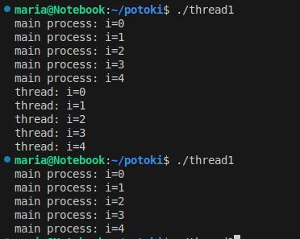
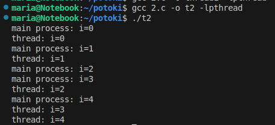
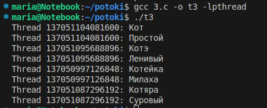
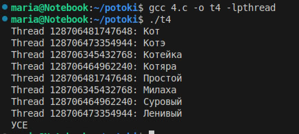
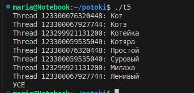
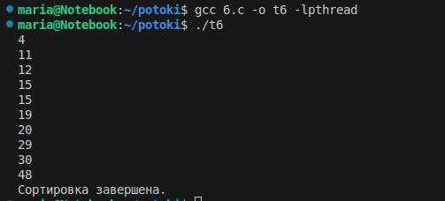

## Сибирский Государственный Университет Телекоммуникаций и Информатики
##
##
## Отчет по лабораторной работе №7 "Знакомство с POSIX потоками"
##
## Студента: 
## Дроздовой Марии
## Группы : ИКС-433
##
## Оценка 3. Знакомство с pthread:
## 1.Создать поток.Написать программу, которая создает поток с помощью pthread_create(). Использовать атрибуты по умолчанию. Родительский и дочерний потоки должны вывести на экран по 5 строк текста.
![Вывод терминала (1)]

## 2.Ожидание потока. Модифицировать (1) так, что родительский поток выводит текст после завершения дочернего потока. Подсказка: pthread_join()
![Вывод терминала (2)]

## 3.Параметры потока. Модифицировать (2) так, что основной поток создает 4 потока, исполняющих одну и ту же функцию. Эта функция должна распечатать последовательность текстовых строк, переданных как параметр. Каждый из созданных потоков должен распечатать различные последовательности строк.
![Вывод консоли (3)]

## 4.Завершение нити без ожидания. Добавить сон с помощью sleep() в функцию потоков между выводами строк. Спустя две секунды после создания дочерних потоков основной поток должен прервать работу всех дочерних потоков с помощью pthread_cancel().
![Вывод консоли (4)]

## 5.Обработать завершение потока. Модифицировать (4) так, чтобы дочерний поток перед завершение распечатывал сообщение об этом. Использовать pthread_cleanup_push()
![Вывод консоли (5)]

## 6. Реализовать простой Sleepsort. Реализовать прикольный алгоритм сортировки Sleepsort с асимптотикой O(N) (по времени). Суть алгоритма: на вход подается массив, пусть будет не более 50 элементов и пусть будет состоять из целочисленных значений. Для каждого элемента массива создается отдельный поток, в который в качестве аргумента передается значение элемента. Сам поток должен уйти в сон с помощью sleep() или usleep() с параметром равным аргументу потока (значение элемента массива), а после вывести на экран значение.
![Вывод консоли (6)]
###### Новосибирс, 2025г